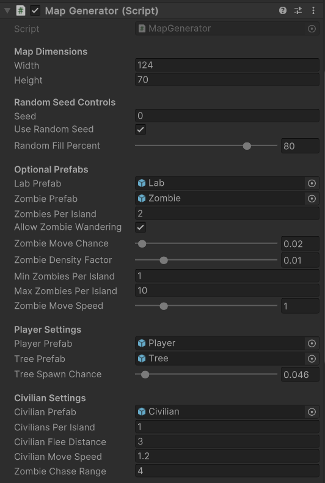

# Zombie Archipelago Procedural Level Generator  
**Author:** Mohammad Inshaul Haque (240406998)  
**Unity Version:** 2023.1.13f1

---

## Project Overview

This Unity project simulates a procedurally generated zombie apocalypse scenario, set across a chain of islands. The player starts on a safe island and must navigate toward a glowing research lab — the objective — while autonomous zombies roam and civilians flee or turn into zombies if caught.

All functionality is built within a single Unity scene (`Main.unity`) and implemented entirely in the `MapGenerator.cs` script, following a structured 3-stage generation pipeline.

)  
*Figure: Scene View of generated zombie island layout with trees, lab, zombies, civilians, and player.*

---

## Core Generation Pipeline

The procedural level generation follows three main stages:

### Stage 1: Initial Map Creation
- A 2D grid is initialized using a **seed** (random or manual).
- **Circular islands** are generated based on the `Random Fill Percent`. A value of **80%** was chosen as it resulted in a good density of landmasses suitable for gameplay and AI navigation.

### Stage 2: Cellular Automata Smoothing
- A **5-step smoothing algorithm** is applied to transform rough island shapes into more natural forms.
- All borders are set to water to prevent generation artifacts.

### Stage 3: Post-Processing & Object Spawning
- **Small islands** are removed; **small lakes** are filled in.
- **Connected land regions** are identified for spawning gameplay elements:
  - A **glowing Lab (yellow cube)** is placed at the center of a randomly selected large island.
  - **Player** is spawned on the **safest island** (with the fewest zombies and not the lab island).
  - **Zombies (red cubes)** are distributed proportionally based on island size (`Zombie Density Factor`).
  - **Trees (green spheres)** are placed randomly on land with a **4.6% chance**, balancing visual appeal and performance.
  - **Civilians (cyan cubes)** are randomly spawned and exhibit autonomous fleeing behavior.

---

## Autonomous Agent Behaviors

The simulation includes two types of autonomous agents with basic AI logic:

### 🧟 Zombies (Red Cubes)
- Continuously **rotate to face the lab** using Quaternion math.
- If `Allow Zombie Wandering` is enabled:
  - **Patrol randomly** around their island.
  - **Chase civilians** if they enter within a detection radius (`Zombie Chase Range` = 4f).
  - **Catch civilians** and **turn them into zombies**, cloning their appearance and behavior.

### 👤 Civilians (Cyan Cubes)
- **Wander idly** across their island.
- **Flee** when a zombie is detected within `Civilian Flee Distance` (set to 3f).
- If caught (i.e., zombies reach them), they are destroyed and replaced by new zombie clones.

These behaviors are handled via:
- `MoveCivilians()`
- `MoveZombiesWithChase()`
- `RotateZombiesTowardLab()`

Movement is based on transform updates (not pathfinding), aligning with the 2D requirement.

---

## Gameplay Representation

- **Player**: Cylinder with light — represents the **starting point**.
- **Lab**: Glowing yellow cube — serves as the **goal/destination**.
- **Zombies**: Red cubes that actively roam or pursue.
- **Civilians**: Cyan cubes that flee and can transform if caught.
- **Trees**: Green spheres scattered randomly across land for aesthetic purpose.

All objects are created using Unity **primitive prefabs**, fulfilling the constraint of no external assets.

---

## Parameter Settings (Inspector)

These parameters are exposed in the Unity Inspector for full control and fine-tuning:

### Map & Seed
- `Width`, `Height`: Dimensions of the generated map grid.
- `Seed`: Custom string to generate the same map layout.
- `Use Random Seed`: When enabled, uses a new random layout each time.
- `Random Fill Percent` = 80: Controls initial land density.

### Zombies
- `Zombie Density Factor` = 0.01: Controls zombies per island based on size.
- `Min Zombies Per Island` = 1: Minimum zombies per island.
- `Max Zombies Per Island` = 10: Maximum zombies per island.
- `Zombie Move Speed` = 1: Speed of zombie movement.
- `Zombie Chase Range` = 4: Range within which zombies detect and chase civilians.
- `Allow Zombie Wandering` = true: Enables zombie movement and chasing.

### Civilians
- `Civilians Per Island` = 1: Number of civilians spawned per island.
- `Civilian Flee Distance` = 3: Distance at which civilians start fleeing from zombies.
- `Civilian Move Speed` = 1.2: Speed of civilian movement (slightly faster than zombies for fairness).

### Environment
- `Tree Spawn Chance` = 0.046 (4.6%): Probability of placing a tree on a land tile.
- `Tree Prefab`: Assigned green sphere prefab for decorative vegetation.
- `Lab`, `Player`, `Zombie`, `Civilian` Prefabs: All created from Unity primitives.

![Inspector View] ()  
*Figure: Unity Inspector showing exposed procedural and agent parameters.*

---

## How to Use

1. Open `Main.unity` in Unity 2023.1.13f1.
2. Click **Play** to generate a random zombie island scenario.
3. Left-click at runtime to regenerate the map (if random seed is enabled).

---

## Additional Feature

This project includes an original **Autonomous Agent Simulation**:
- **Zombie and Civilian Interactions**: fleeing, chasing, and transformation behavior.
- This was designed by the student to fulfill the “additional feature” criteria and demonstrate agent integration in a procedurally generated world.

---

## AI Assistance

The student used **ChatGPT (OpenAI)** throughout development to:
- Debug and refine AI behaviors.
- Add features like zombie chasing, civilian fleeing, and transformation mechanics.
- Structure the `MapGenerator.cs` script with consistent commenting and optimization.
- Help write and improve documentation (including this README).
- Explore alternatives to pathfinding that adhere to the 2D constraint.

All AI-generated content was reviewed, customized, and implemented manually by the student.

---

## Credits and References

- **Starter Project**: Based on “Generator” from QMPlus (Cellular Automata by Sebastian Lague).
- **Inspiration**: [Sebastian Lague’s Procedural Cave Generation](https://www.youtube.com/playlist?list=PLFt_AvWsXl0eZgMK_DT5_biRkWXftAOf9)
- **Design & Logic**: All code written by the student, including full implementations of map creation, smoothing, cleanup, and AI behaviors.
- **Assets**: All visual elements created from Unity primitives (no third-party models or assets used).

---

## Final Remarks

This project meets all core coursework requirements, demonstrating:
- A complete procedural level pipeline (Stages 1–3).
- Autonomous agent behavior (wander, chase, flee, transform).
- Scene customization and parameterization for simulation control.
- Creative design aligned with the apocalypse archipelago brief.

All code is located in a single file, `MapGenerator.cs`, and should be reviewed for structure and educational purposes.
