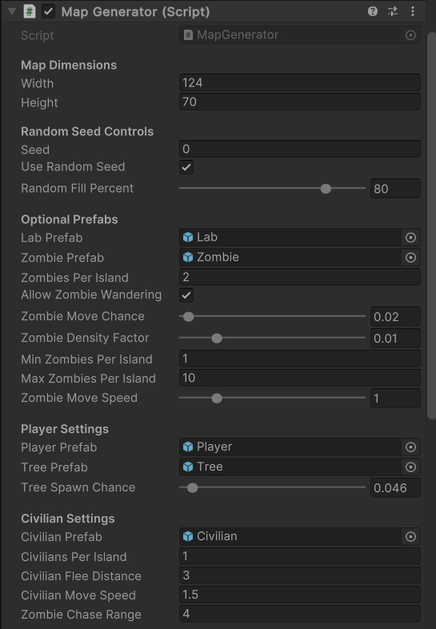

# Zombie Archipelago Procedural Level Generator - Mohammad Inshaul Haque (240406998)

## Project Overview

This Unity project implements a procedurally generated level based on a zombie apocalypse scenario where a player navigates an archipelago of islands in search of a glowing research lab. The level dynamically spawns terrain (islands and water), gameplay elements (zombies, civilians, player), and visual props (trees) to create a rich simulation without requiring a full game loop.

Developed using Unity **2023.1.13f1**, all features are implemented in a single main scene (`Main.unity`) and organized via a single core script: **MapGenerator.cs**.

---

## Key Features

- 🌍 **Procedural Island Generation** using cellular automata and region detection.
- 🔦 **Glowing Research Lab (Objective)**, spawned on a larger island.
- 🧍‍♂️ **Player Start Point** (cylinder with light), placed on the safest island.
- 🧟‍♂️ **Wandering Zombies** that face the lab and patrol their island.
- 🌲 **Random Tree Placement** across land tiles for environmental variety.
- 👨‍👩‍👧 **Autonomous Civilians (cyan cubes)** who patrol the island and **flee from nearby zombies**.
- 🧟‍♂️➡️👤 **Zombie Chase Behavior** that dynamically reacts to nearby civilians.

---

## Procedural Generation Pipeline

The entire logic is encapsulated in `MapGenerator.cs` and runs in three main stages:

### 1. Initial Map Creation
- Grid size (Width × Height) and land density (% filled) are configurable.
- Circular islands are placed randomly on a water map using seed-based or random generation.

### 2. Smoothing (Cellular Automata)
- Land and water cells are updated over 5 iterations to form natural-looking islands.
- Border cleanup ensures maps are always surrounded by water.

### 3. Post-processing & Object Spawning
- **Small islands** and **lakes** below a size threshold are removed or filled.
- **Contiguous land regions** are identified for controlled spawning of:
  - Lab (on a larger island)
  - Zombies (proportional to island size)
  - Player (on safest island)
  - Trees (based on spawn chance)
  - Civilians (randomly on each island)

---

## AI & Autonomous Agent Behaviors

This project includes two types of autonomous agents:

### Zombies (Red Cubes)
- **Rotate toward the lab** constantly using `Quaternion.LookRotation`.
- **Wander** around their island (if `allowZombieWandering` is enabled).
- **Chase civilians** if they come within the `zombieChaseRange`.

Implemented Methods:
- `RotateZombiesTowardLab()`
- `MoveZombiesWithChase()`

### Civilians (Cyan Cubes)
- **Idle wandering** around their spawn island.
- **Flee** when zombies approach within `civilianFleeDistance`.

Implemented Method:
- `MoveCivilians()`

These behaviors use basic steering logic and transform-based movement. No pathfinding or navigation mesh is used due to the 2D nature of the project.

---

## Scene View

In the editor, you can observe:
- **Green land tiles** and **cyan water** using Gizmos.
- **Lab** marked with a glowing yellow cube.
- **Zombies** as red cubes rotating toward the lab.
- **Civilians** as cyan cubes that flee when approached.

---

## MapGenerator Script Inspector Parameters

Below are the key parameters exposed in Unity’s Inspector:

### Map Dimensions
- `Width`, `Height` – Controls grid size.

### Random Seed Controls
- `Seed`, `Use Random Seed`, `Random Fill Percent` – Affects initial layout randomness.

### Prefabs
- `Lab Prefab`, `Zombie Prefab`, `Player Prefab`, `Tree Prefab`, `Civilian Prefab`

### Zombie Settings
- `Zombie Move Chance`, `Zombie Density Factor`
- `Min/Max Zombies Per Island`
- `Zombie Move Speed`
- `Allow Zombie Wandering`

### Tree Settings
- `Tree Spawn Chance` – % chance per tile.

### Civilian Settings
- `Civilians Per Island`
- `Civilian Flee Distance`
- `Civilian Move Speed`
- `Zombie Chase Range`

All values were carefully tuned for optimal simulation balance (see attached screenshots for the test configuration).

---

## How to Run

- Open the **Main.unity** scene.
- Press **Play** to generate a level.
- Click the **left mouse button** to regenerate with a new seed (if random seed is enabled).

---

## Technical Summary

| Feature                | Implemented |
|------------------------|-------------|
| Procedural Terrain     | ✅          |
| Autonomous Agents      | ✅ (Zombies, Civilians) |
| AI Behaviors           | ✅ (Wander, Flee, Chase) |
| Environment Generation | ✅          |
| Object Placement Logic | ✅          |
| Gizmo Debugging        | ✅          |
| Configurable Parameters| ✅          |
| Light-based Markers    | ✅          |

---

## Credits and References

### Procedural Generation
- **Based on**: [Sebastian Lague’s Procedural Cave Generation Tutorial Series](https://youtube.com/playlist?list=PLFt_AvWsXl0eZgMK_DT5_biRkWXftAOf9)
- **Adapted by**: Student (customized for island generation, lab logic, civilian & zombie placement).

### Design and Implementation
- All logic in `MapGenerator.cs` was implemented by the student, including additional methods like `MoveZombiesWithChase()` and `MoveCivilians()` to demonstrate agent-based interactivity.

### AI Assistance
- **ChatGPT (OpenAI)** was used to:
  - Suggest improvements for zombie/civilian behavior.
  - Help with debugging logic.
  - Guide structuring and documentation (including this README).
- All AI-generated code was reviewed and integrated manually by the student.

### Assets
- All prefabs (lab, player, zombie, civilian, tree) were created from Unity primitives.
- No external models, textures, or packages were used.

### Acknowledgements
- Thanks to **Queen Mary University of London** instructors and **Sebastian Lague** for their inspiration and guidance materials.

---

## Final Notes

This project fulfills the coursework requirements for the "Interactive Agents and Procedural Generation" module by demonstrating:
- A complete procedural level design,
- Integration of autonomous AI agents,
- Simulation logic that aligns with the narrative of a post-apocalyptic survival experience.

All logic is confined within the `MapGenerator.cs` script and can be reviewed for detailed implementation and educational purposes.

